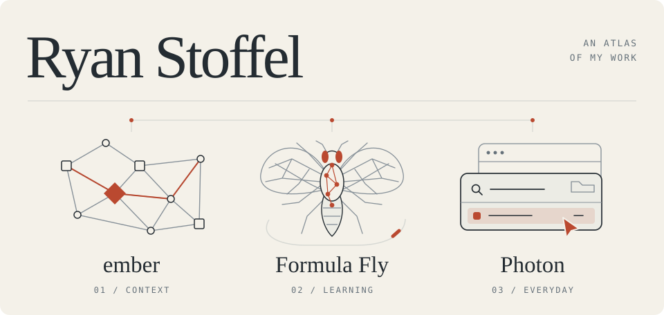

<picture>
  <source media="(max-width: 600px) and (prefers-color-scheme: dark)" srcset="./assets/atlas-mobile-dark.svg">
  <source media="(max-width: 600px) and (prefers-color-scheme: light)" srcset="./assets/atlas-mobile-light.svg">
  <source media="(prefers-color-scheme: dark)" srcset="./assets/atlas-dark.svg">
  <source media="(prefers-color-scheme: light)" srcset="./assets/atlas-light.svg">
  
</picture>

**Software · Systems · Applied AI**

I'm a computer science senior at California Baptist University, concentrating in AI and machine learning. I like building things end to end, from the environment a system runs in to the interface someone uses.

### A little background

At **NSWC Corona**, I spent my summer 2026 NREIP internship building local AI infrastructure with NixOS, Docker, PostgreSQL, and C#/.NET. Earlier, at **CBU's AI & Machine Learning Lab**, I worked on a Salesforce matching engine, bringing recommendation times from 45–60 seconds down to about 3 seconds.

### A working index

**01 / [ember](https://github.com/cbu-capstone-design-27/ember)**\
Giving coding agents context through a typed knowledge graph. An early-stage capstone exploring project decisions, conventions, and relationships through MCP.

**02 / [Formula Fly](https://github.com/cbu-machine-and-deep-learning-26/formula-fly)**\
Can a fly's neural wiring help it learn to drive? A simulation project exploring connectome-based networks and reinforcement learning.

**03 / Small tools for the everyday**\
[Photon](https://github.com/ryan-stoffel/photon) is a native macOS launcher. [Tidy](https://github.com/ryan-stoffel/tidy) puts files where they belong. My [dotfiles](https://github.com/ryan-stoffel/dotfiles) keep the environment reproducible with Nix.

A couple more things I've worked on

- [Bogey Busters](https://github.com/ryan-stoffel/bogey-busters) — a golf tracking app built with Flutter and Firebase.
- [SnapDose](https://github.com/cbu-jr-design-26/snap-dose) — team lead on a university project bringing glucose monitoring, AI-assisted carb estimation, and a pump simulator into one app.

---

[Portfolio](https://ryanstoffel.dev/) · [LinkedIn](https://www.linkedin.com/in/ryan-stoffel/)
