<picture>
  <source media="(max-width: 600px) and (prefers-reduced-motion: reduce)" srcset="./assets/terminal-mobile-static.svg">
  <source media="(prefers-reduced-motion: reduce)" srcset="./assets/terminal-static.svg">
  <source media="(max-width: 600px)" srcset="./assets/terminal-mobile.svg">
  
</picture>

[Portfolio](https://ryanstoffel.dev/) · [LinkedIn](https://www.linkedin.com/in/ryan-stoffel/)

I'm a computer science senior at California Baptist University, concentrating in AI and machine learning. I like building things end to end, from the environment a system runs in to the interface someone uses.

### Experience

At **NSWC Corona**, I spent my summer 2026 NREIP internship building local AI infrastructure with NixOS, Docker, PostgreSQL, and C#/.NET. Earlier, at **CBU's AI & Machine Learning Lab**, I worked on a Salesforce matching engine, bringing recommendation times from 45–60 seconds down to about 3 seconds.

### Selected work

**01 / [ember](https://github.com/cbu-capstone-design-27/ember)**\
An early-stage capstone exploring how a typed knowledge graph and MCP can give coding agents context about project decisions, conventions, and relationships.

**02 / [Formula Fly](https://github.com/cbu-machine-and-deep-learning-26/formula-fly)**\
A simulation project exploring reinforcement learning for driving with networks based on a fly's neural wiring.

**03 / Small tools for the everyday**\
[Photon](https://github.com/ryan-stoffel/photon) is a native macOS launcher. [Tidy](https://github.com/ryan-stoffel/tidy) organizes files with configurable rules. My [dotfiles](https://github.com/ryan-stoffel/dotfiles) keep the environment reproducible with Nix.

More projects

- [Bogey Busters](https://github.com/ryan-stoffel/bogey-busters) — a golf tracking app built with Flutter and Firebase.
- [SnapDose](https://github.com/cbu-jr-design-26/snap-dose) — team lead on a university project bringing glucose monitoring, AI-assisted carb estimation, and a pump simulator into one app.

