<a href="https://ryanstoffel.dev">
<picture>
  <source media="(prefers-color-scheme: dark)" srcset="./assets/header-dark.svg">
  
</picture>
</a>

Software engineer focused on backend systems, infrastructure, and applied AI. I like building things end to end, from the environment a system runs in to the interface someone uses.

**Studying** &nbsp; B.S. Computer Science, AI/ML · Cal Baptist · May 2027 
**Recently** &nbsp; Software Engineer Intern, NSWC Corona 
**Based in** &nbsp; Corona, California

 

<a href="#experience">
<picture>
  <source media="(prefers-color-scheme: dark)" srcset="./assets/headings/experience-dark.svg">
  
</picture>
</a>

### Software Engineer Intern

**Naval Surface Warfare Center, Corona Division** · Jun – Aug 2026

Built an AI operations assistant into a naval range scoring platform, a WPF/.NET desktop application in a DoD environment. Operators control range hardware from chat, and disruptive actions wait for human approval. The agent stack runs in Docker on a self-configuring NixOS gateway VM, and an offline installer deploys it to air-gapped sites.

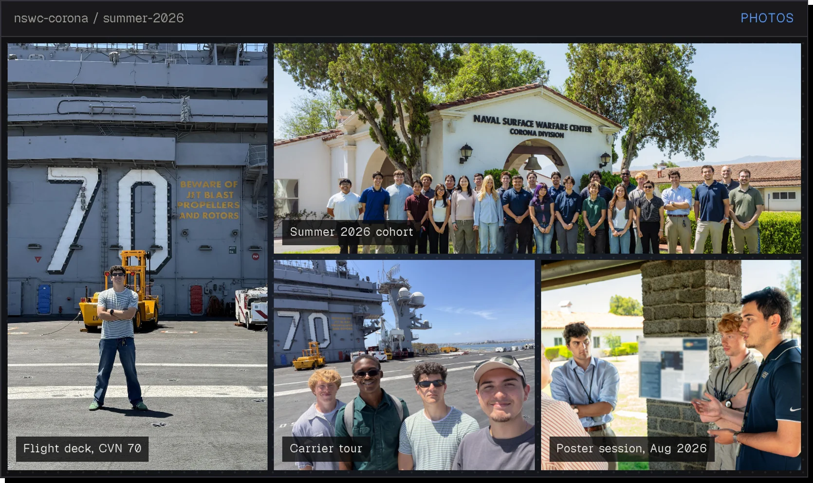

`C#` `.NET` `WPF` `WebSockets` `NixOS` `Docker` `PostgreSQL`

### Software Engineer Research Assistant

**CBU AI & Machine Learning Lab** · May 2025 – Apr 2026

Cut recommendation latency from 60s to 3s on the DINA Matching Engine, a recommendation system for a production Salesforce org, by pairing a Python data pipeline with pgvector similarity search in PostgreSQL on GCP.

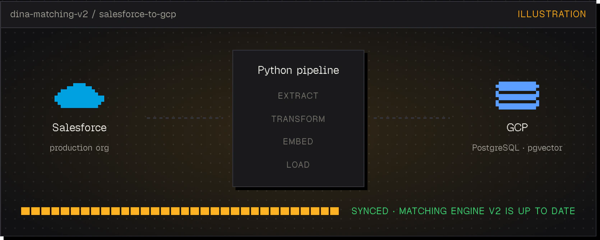

`Python` `Salesforce` `Apex` `PostgreSQL` `pgvector` `GCP`

 

<a href="#projects">
<picture>
  <source media="(prefers-color-scheme: dark)" srcset="./assets/headings/projects-dark.svg">
  
</picture>
</a>

What I'm building now. Each one links to its code.

### [Ember](https://github.com/cbu-capstone-design-27/ember)

**Senior capstone. Project memory for AI coding agents.** · Apr 2026 – now

<a href="https://github.com/cbu-capstone-design-27/ember">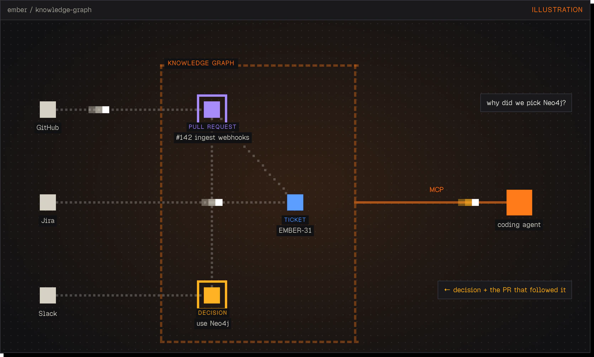</a>

A typed knowledge graph of why a codebase is the way it is: decisions, tickets, pull requests, and the people behind them. It fills itself from GitHub, Jira, Slack, Teams, and GitLab, and serves that context to coding agents through an MCP server. I own GitHub ingestion, the GitHub to Jira sync, and the retrieval pipeline. Graph retrieval matched embedding search accuracy with 35–45% fewer tokens.

`Python` `Neo4j AuraDB` `MCP` `GitHub Webhooks` `Jira REST API`

### [Formula Fly](https://github.com/cbu-machine-and-deep-learning-26/formula-fly)

**A race car driven by a fruit fly's visual system.** · Sep 2026 – now

<a href="https://github.com/cbu-machine-and-deep-learning-26/formula-fly">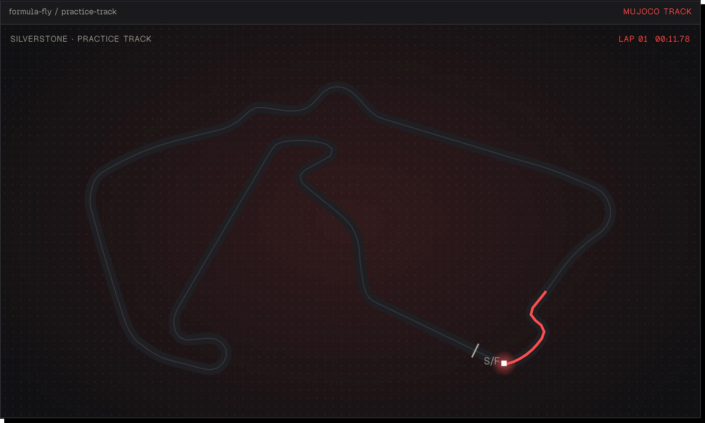</a>

A simulated driver whose eye is a model of the fruit fly optic lobe, wired from the real fly connectome. It trains on a MuJoCo practice track built from Silverstone's centerline. The question behind it: is fly wiring a useful prior for closed-loop control, or only a constraint?

`Python` `PyTorch` `MuJoCo` `NumPy` `flyvis`

### [Parallax](https://github.com/ryan-stoffel/parallax)

**Coding agents on computers you own.** · Sep 2026 – now

<a href="https://github.com/ryan-stoffel/parallax">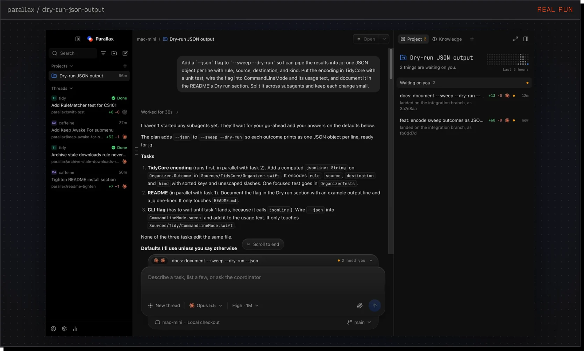</a>

An open-source desktop app for coordinator-and-subagent AI projects. A coordinator chat plans the work and hands pieces to subagents, each in its own git worktree. The work runs in plxd, a Rust daemon on your machine or a remote host over SSH, so a project keeps running with the laptop closed.

`Rust` `TypeScript` `Electron` `GitHub Actions` `Linear`

### [SnapDose](https://github.com/cbu-jr-design-26/snap-dose)

**Junior design project. Team lead.** · Jan – Apr 2026

<a href="https://github.com/cbu-jr-design-26/snap-dose">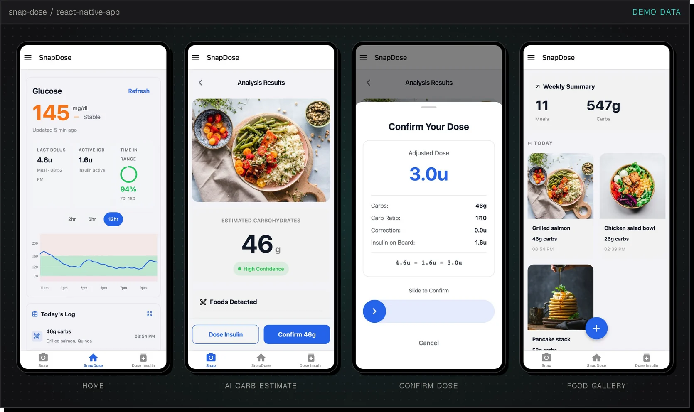</a>

Led a 5-person team building a Type 1 Diabetes management app. I architected the Java Spring Boot REST API on GCP Cloud Run with Firestore, behind a React Native client. It reads live glucose from the Dexcom CGM API, estimates carbs from a meal photo with Gemini, and sends bolus commands to an ESP32-P4 insulin pump simulator.

`Java` `Spring Boot` `React Native` `GCP Cloud Run` `Firestore` `Gemini` `ESP32-P4`

 

<a href="#tools">
<picture>
  <source media="(prefers-color-scheme: dark)" srcset="./assets/headings/tools-dark.svg">
  
</picture>
</a>

Smaller software I build and use. The macOS apps install from my Homebrew tap.

<table>
  <tr>
    <td width="140"><a href="https://github.com/ryan-stoffel/photon">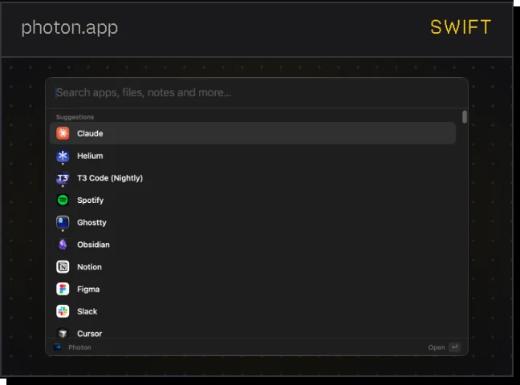</a></td>
    <td><b><a href="https://github.com/ryan-stoffel/photon">Photon</a></b> · Swift
       A fast, minimal launcher for apps, clipboard history, notes, file search, and window keybinds.</td>
  </tr>
  <tr>
    <td width="140"><a href="https://github.com/ryan-stoffel/tidy">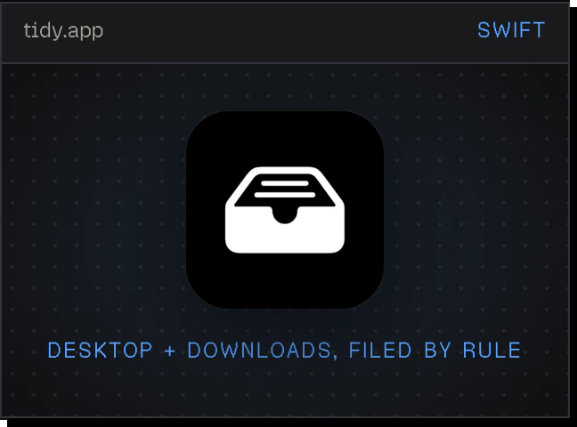</a></td>
    <td><b><a href="https://github.com/ryan-stoffel/tidy">Tidy</a></b> · Swift
       Files your Desktop and Downloads by rule the moment files land.</td>
  </tr>
  <tr>
    <td width="140"><a href="https://github.com/ryan-stoffel/caffeine">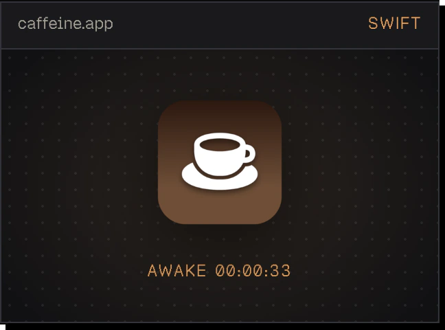</a></td>
    <td><b><a href="https://github.com/ryan-stoffel/caffeine">Caffeine</a></b> · Swift
       Keeps the display awake from the menu bar, with a lid-closed mode and an awake timer.</td>
  </tr>
  <tr>
    <td width="140"><a href="https://github.com/ryan-stoffel/hush">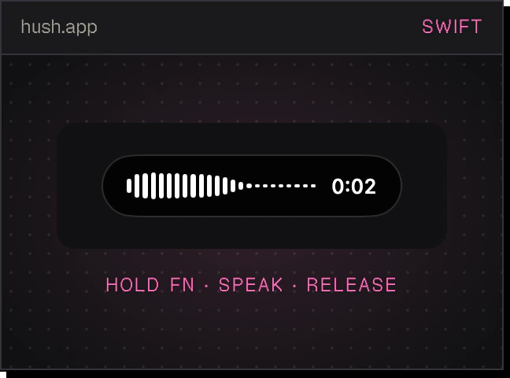</a></td>
    <td><b><a href="https://github.com/ryan-stoffel/hush">Hush</a></b> · Swift · in progress
       Hold a key, speak, release. On-device dictation into any app.</td>
  </tr>
  <tr>
    <td width="140"><a href="https://github.com/ryan-stoffel/dotfiles">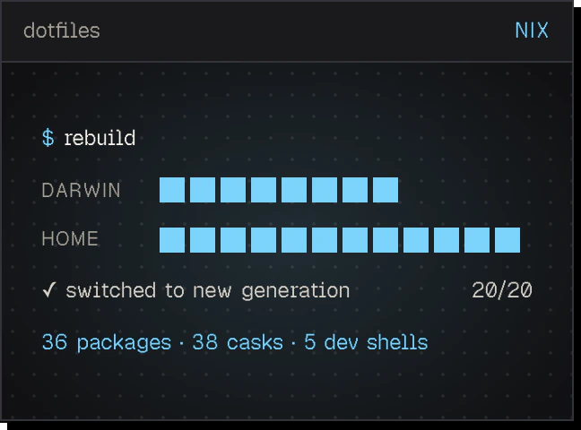</a></td>
    <td><b><a href="https://github.com/ryan-stoffel/dotfiles">dotfiles</a></b> · Nix
       This Mac as code: nix-darwin, Home Manager, and sops-encrypted secrets.</td>
  </tr>
  <tr>
    <td width="140"><a href="https://github.com/ryan-stoffel/bogey-busters">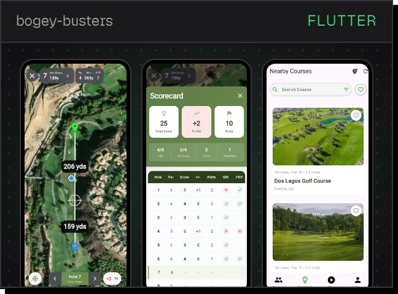</a></td>
    <td><b><a href="https://github.com/ryan-stoffel/bogey-busters">Bogey Busters</a></b> · Flutter
       Golf tracking with GPS course navigation, live scoring, and a social feed.</td>
  </tr>
</table>
